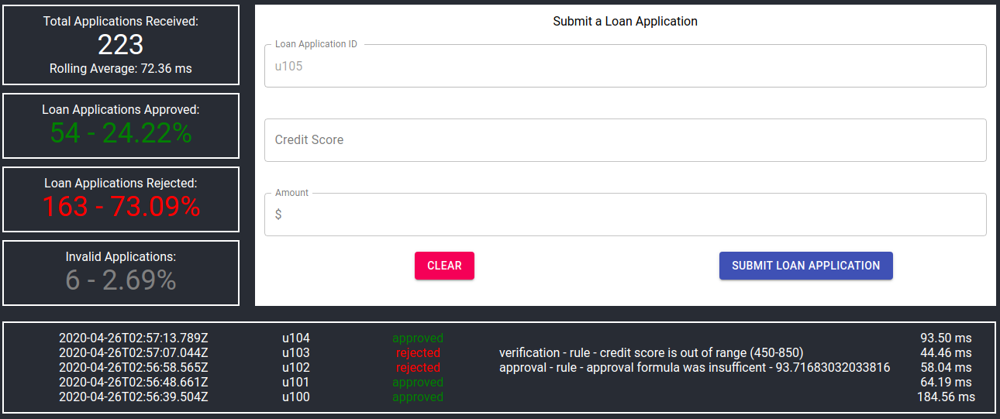

# Loan Kube
Test application for use on Openshift or with docker-compose.  See the individual Deployment sections for more details.
This application simulates a rudimentary workflow a bank loan application, through user submission, verification of the loan application, and approval process.  Data is persisted in a ephemeral Postgres database.

Instead of a single monolithic application, this demo showcases a basic microservice approach - intent on how multiple services could be developed, executed, and integrated independent from each other.

This solution should not be used in a production environment.  It should be used to highlight microservices, containers, and container orchestration capabilities.


## Stucture
The Loan Kube demo application is broken into 6 components.

### Postgres Database
The supported backend data store for the application.  By default, the demo does not persist data to disk beyond what is stored in the container.  **Once the container is restarted/recreated, the previous sessions loan applications would be unavailable.**

The Postgres database should not be considered a secure data store.  It uses *POSTGRES_HOST_AUTH_METHOD=trust* so it is completely accessible without user authentication.

### LoanData Service
LoanData is a NodeJs API service that provides a single entrypoint into the Postgre backend.  It is the onlly component that interacts directly with the backend data store.

For testing purposes, by default, port *3000* is exposed outside of the application (internal port 80 for the container).  However, the port does not NEED to be exposed as the only interaction should be from the LoanUI web application.  That communication is proxied within the container sub-network.

### LoanVerification Service
LoanVerification is a NodeJs API service that evaluates incoming loan applications and test for completeness and accuracy in the application.

Currently, there is only 3 fields in the demo loan application - *loanId*, *creditScore*, and *loanAmount*.  
* *loanId* is checked that it exists
* *creditScore* is checked that is exists, is a number, and within an acceptable range (450-850)
* *loanAmount* is checked that is exists, is a number, and within an accetable range (1000, 10000000)

### LoanApproval Service
LoanApproval is a NodeJs API service that provides the calculation as to if the loan will be rejected or approved.  The loan should have passed through the LoanVerification process **first**.

The calculation applies a elementary sliding scale based on credit score worthiness (higher being better) against some loan amount (higher is more difficult to obtain).  The calculation is for **demo purposes only**!

If rejected, it will return an indicator that look something like 92.8763221 or 103.23094.  If the indicator is above 100, the loan is approved, otherwise, it is rejected.

### LoanProcessor
LoanProcessor is a NodeJs API service that is the entrypoint for the loan application process.  It will initially persist the application (via the LoanData service), and then forward along to the LoanVerification and LoanApproval processes appropriately.

The LoanProcessor also initiates the starting time for a loan application to evaluate processing time.  Successive processes support the ending time.

For testing purposes, by default, port *3006* is exposed outside of the application (internal port 80 for the container).  However, the port does not NEED to be exposed as the only interaction should be from the LoanUI web application.  That communication is proxied within the container sub-network.

### LoanUI
LoanUI is a ReactJs + NodeJs web application, built from the very popular [create-react-app](https://github.com/facebook/create-react-app), originally from the development teams at Facebook.

The LoanUI web application allows users to submit a loan application, review their results (any application where the Loan Application ID is prefixed with a *'u'*), and see overall statistics on application approval and rejection rates.



By default, the LoanUI web application is exposed on port *8003*, but can be configured to another port or, if using an ingress or load balancing utility, a named service (like http://loankube.example.com).

### (EXTRA) MassTest
MassTest is a Python 3 console application that provides bulk application submittals.  The MassTest application is *NOT* containerized and may need to be configured to point to the appropriate LoanProcessor exposed API.

Execute MassTest like this (the last argument (101) can be any number and represents the number of application to submit):
```
python3 test.py 101
```


## Deployment

## Docker-Compose

## Pre-requisites
Docker and docker-compose should be installed and correctly configured.

## Deploy Application
The docker compose installation is meant to be completely self-contained without any need for additional configuration to deploy.

After cloning this project, navigate to the root application folder and execute:
```
docker-compose up -d --build
```

The *--build* command will build the container images prior to deploying to local Docker instance.

This will build and install the 6 container images (described above) into Docker.

To cleanup the project, from the same folder execute:
```
docker-compose down
```


# OpenShift
*Please note that I am using generic passwords in the documenation.  Obviously, change at will.*  
**todo: needs additional documentation attention**
**todo: double check ports can be 80 in OpenShift....might need to be above 1023**

# Deploy Application
Create your project and log into the project from the oc command line tool.

### Postgres Database 
(no backend storage defined...will use temporary storage while it is running and remove it when the pod is stopped)
```
oc new-app -e POSTGRES_HOST_AUTH_METHOD=trust --name=postgres postgresql
```

#### Initialize Database (todo: see if this can be merged into the above command automatically)
We'll want to make this run as an Init container in the future
Get running Postgresql pod

```
oc get pods
```  
```
oc rsh postgresql-1-czdh4  # replace with your pod name
``` 

Once exe'd into the pod, run psql from the command prompt and init database with the following commands:  
``` 
psql -U postgres
``` 
```
CREATE TABLE applications (application_id varchar(50) PRIMARY KEY, loan_data VARCHAR (512) UNIQUE NOT NULL, application_status varchar(10), modified TIMESTAMP NULL,start TIMESTAMP NULL);
```
And lastly, exit out psql and the pod.

### LoanKube Application
#### Data Service
```
oc new-app https://github.com/Guarrdon/LoanKube.git --context-dir=loanDataService-Postgres --name=loandata -e PGHOST=postgre -e PGUSER=postgres
```
#### Verification Service
```
oc new-app https://github.com/Guarrdon/LoanKube.git --context-dir=loanVerificationService --name=loanverification -e LOANDATA_SERVICE=loandata
```
#### Data Service
```
oc new-app https://github.com/Guarrdon/LoanKube.git --context-dir=loanApprovalService --name=loanapproval -e LOANDATA_SERVICE=loandata
```
#### Processor Service
```
oc new-app https://github.com/Guarrdon/LoanKube.git --context-dir=loanProcessorService --name=loanprocessor \
-e LOANDATA_SERVICE=loandata \
-e LOANVERIFICATION_SERVICE=loanverification \
-e LOANAPPROVAL_SERVICE=loanapproval
```
#### UI Web 
```
oc new-app https://github.com/Guarrdon/LoanKube.git --context-dir=loanUI --name=loanui \
-e LOANDATA_SERVICE=loandata \
-e LOANVERIFICATION_SERVICE=loanverification \
-e LOANAPPROVAL_SERVICE=loanapproval
```
### Expose Web and Test Integration

* Finally, exose the processor service.
* If you would like to see the back-end data store, expose the data service as well.

